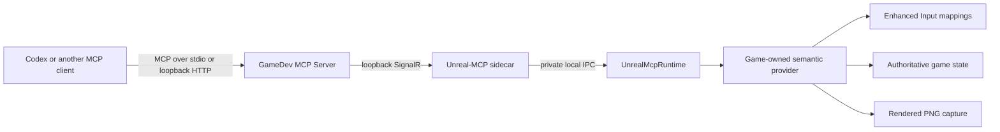

# Automated Unreal Engine 5.8.1 + Codex Playtesting Pipeline

_Generalized from a qualified Unreal Engine game prototype._

## What this is

This guide describes a Playwright-style agentic testing loop for a native,
packaged Unreal Engine game. It does not embed Playwright or turn the game into
a browser. Instead, the game exposes a small Model Context Protocol (MCP)
surface that lets an agent inspect authoritative gameplay state, issue bounded
player input, wait for simulation, assert results, capture rendered frames, and
retain evidence for a human reviewer.

```text
inspect -> act -> wait -> inspect/assert -> capture -> review -> revise
```

The accompanying templates are a public starting point, not a drop-in Unreal
plugin. Every game must implement and review its own semantic provider. The
original game source, packaged builds, Epic assets, downloaded binaries,
credentials, and local project history are intentionally excluded.

## Status and scope

The architecture was qualified on Linux with Unreal Engine 5.8.1 and a packaged
Development build. The dependency versions below are tested historical pins,
not claims that they remain latest. Recheck upstream compatibility, security,
licenses, release signatures, and hashes before adopting the design.

This pipeline complements human playtesting. It can prove integration,
repeatability, movement deltas, state transitions, and capture availability. It
cannot prove that combat feels good, animation looks natural, controls are
accessible, or a game is fun.

There are two different kinds of evidence. Structural assertions come from the
game-owned state contract: transforms, resources, transitions, and timing. A
rendered PNG is pixel evidence for composition, materials, lighting, UI, and
obvious regressions. Neither replaces the other, and visual approval remains a
human decision.

A third optional layer is a local review worker. It may classify already
captured evidence or, in a future bounded journey loop, propose one action from
a closed game-owned catalog. It is not a Codex-native subagent and does not
receive repository, shell, Git, or mutation authority. The public boundary is
the provider-neutral task/result protocol in `docs/local-model-workers.md`, not
Qwen or any other particular model family.

## Architecture



Two paths are useful:

- **Interactive agent path:** a project-scoped Codex MCP configuration starts
  the local server over STDIO. A Development game opts into automation.
- **Regression path:** a bounded shell harness starts a separate loopback HTTP
  server, packaged game, deterministic driver, evidence directory, and cleanup.

Do not expose arbitrary console execution, shell access, Blueprint mutation,
actor spawning, or unrestricted reflection. Register small tools that describe
game concepts.

## Tested dependency pins and attribution

| Component | Tested pin | Qualification checksum |
|---|---|---|
| Unreal Engine | 5.8.1 Linux | Local engine build; governed by Epic's license |
| [`IvanMurzak/Unreal-MCP`](https://github.com/IvanMurzak/Unreal-MCP) | `v0.13.1`, commit `86fc73d7da25b069845139bb9d378aabfc92a2e6` | Source archive SHA-256 `1c7899b186d805a035f2f1f46798e023998cdff965610939234a29740fb7459c` |
| Unreal MCP Linux sidecar | `v0.13.1` release asset | SHA-256 `48b87c7f028744c0457dc87d0d6d7dc15c56dedd775931bf7abca666475039e8` |
| [`IvanMurzak/GameDev-MCP-Server`](https://github.com/IvanMurzak/GameDev-MCP-Server) | `v9.2.4`, Linux x64 | Archive SHA-256 `5ec1d57cdd4a0f1c772a5b1df0dd8250c4a82ad67919fa225316bb90c2c29df2`; executable SHA-256 `adba20e58cfefe751b56681f58e6b7e2fc6f4be2b05e1cffdaa236aa310db4bb` |
| MCP protocol | `2025-06-18` | Used by the reference driver |

The two Ivan Murzak repositories are currently published under Apache-2.0,
copyright Ivan Murzak. Retain their license and notice requirements when
copying or modifying their work. This bundle contains no third-party code or
binaries. Its installer skeletons require adopters to supply and review release
URLs and checksums.

Primary references:

- [Unreal MCP in Unreal Editor (UE 5.8)](https://dev.epicgames.com/documentation/unreal-engine/unreal-mcp-in-unreal-editor?application_version=5.8)
- [Unreal Engine 5.8 release notes](https://dev.epicgames.com/documentation/unreal-engine/unreal-engine-5-8-release-notes)
- [Codex MCP configuration](https://developers.openai.com/codex/mcp)
- [MCP Streamable HTTP transport](https://modelcontextprotocol.io/specification/2025-06-18/basic/transports)
- [OpenAI game-development collection](https://learn.chatgpt.com/use-cases/collections/game-development)

Epic's UE 5.8 Unreal MCP plugin is Experimental and focused on editor
automation. It can spawn and inspect actors, work with assets, and run editor
tests. This runtime design addresses a different boundary: controlling and
observing a packaged game through a narrow game-owned contract. Evaluate the
official plugin independently for authoring; do not combine broad editor
mutation authority with runtime playtesting by default.

## Semantic tool surface

| Example tool | Purpose | Suggested policy |
|---|---|---|
| `game-state` | Player transform/velocity, health, equipment, camera, objective, enemies, timing | Read-only, idempotent |
| `game-move` | Timed forward/right movement and sprint through mapped input | Auto-approve after bounds review |
| `game-action` | Fixed allowlist: jump, dodge, attacks, lock-on, abilities, stop | Auto-approve after bounds review |
| `game-look` | Bounded camera yaw and pitch | Auto-approve after bounds review |
| `game-damage-player` | Exercise damage, guard, defeat, and respawn | Retain write approval |
| `game-reset` | Reload a deterministic test world | Retain write approval |
| `game-capture-request` | Request a clean viewport screenshot | Auto-approve with fixed output path |
| `game-capture-read` | Return latest PNG as MCP image content | Read-only; cap size before and after read |

Prefer structured results and explicit JSON schemas. Include enough state to
assert behavior without inferring it from pixels. Use pixels for visual
evidence, not as a substitute for authoritative state.

Input calls should use the same Enhanced Input mappings as a human. Clamp axes
and durations, track held keys, cancel prior release timers before scheduling
new ones, and make `stop` cancel timers, release every held key, and stop
movement. Serialize calls on the game thread; Epic's official MCP guidance also
warns clients not to overlap tool calls.

## Compile and runtime gates

Automation belongs in Development/test configurations, never Shipping:

```csharp
if (Target.Configuration != UnrealTargetConfiguration.Shipping)
{
    PrivateDependencyModuleNames.AddRange(new[] { "Json", "UnrealMcpRuntime" });
    PublicDefinitions.Add("GAME_WITH_AUTOMATION=1");
}
else
{
    PublicDefinitions.Add("GAME_WITH_AUTOMATION=0");
}
```

Also deny Shipping in the plugin reference and compile the implementation to
no-ops when `GAME_WITH_AUTOMATION` is zero. Build a Shipping target as evidence
that the adapter is absent from that dependency path.

Require an explicit command-line flag before connecting or spawning a sidecar:

```bash
/path/to/MyGame.sh \
  -GameAutomation \
  -GameAutomationHost=http://127.0.0.1:8080
```

Validate that the host resolves only to loopback. In the tested third-party
runtime, the opt-in flag gated `Connect()` and sidecar/server participation, but
the subsystem still armed a private loopback IPC listener during non-Shipping
initialization. A stricter implementation should also gate listener startup.

## Codex and server configuration

The included `config/codex-config.toml.example` is project-scoped. Replace the
placeholder checkout path. Read-only state is low risk; bounded movement, look,
action, and capture can be auto-approved after review. Keep damage, reset, file
mutation, and other destructive tools behind approval.

Never commit OAuth tokens, API keys, cookies, account identifiers, or local
credential stores. A local STDIO server generally needs no network-facing
authentication. If a server uses `--auth none`, force its bind address to
loopback in the launcher; never rely on an overridable default.

The wrapper uses the equivalent of:

```bash
MCP_BIND=loopback MCP_AUTH=none exec gamedev-mcp-server \
  --port 8080 --client-transport stdio --auth none \
  --idle-timeout-seconds 21600
```

`--auth none` is suitable only for forced loopback or STDIO use. A LAN bind,
container bridge, remote port forward, or public URL requires an authenticated
deployment designed for that threat model.

## Dependency installation pattern

The setup skeleton demonstrates these controls:

1. create a unique temporary directory with `mktemp -d`;
2. download only through HTTPS with strict curl options;
3. verify the release archive SHA-256;
4. extract only the intended payload;
5. verify the installed executable SHA-256;
6. revalidate version and executable hash before reuse; and
7. clean temporary files through an EXIT trap.

Do not trust a marker file, version string, or executable bit by itself. Pinning
is not permanent trust: refresh versions deliberately and review upstream diffs.

## Generic build commands

```bash
UE_ROOT=/path/to/UnrealEngine-5.8.1
PROJECT_ROOT=/path/to/game-project
PROJECT_NAME=MyGame

"$UE_ROOT/Engine/Build/BatchFiles/Linux/Build.sh" \
  "${PROJECT_NAME}Editor" Linux Development \
  "$PROJECT_ROOT/Unreal/${PROJECT_NAME}.uproject" -WaitMutex

"$UE_ROOT/Engine/Build/BatchFiles/RunUAT.sh" BuildCookRun \
  -project="$PROJECT_ROOT/Unreal/${PROJECT_NAME}.uproject" \
  -noP4 -platform=Linux -clientconfig=Development \
  -build -cook -stage -pak -archive \
  -archivedirectory="$PROJECT_ROOT/Unreal/Builds/Automation" -utf8output
```

Ignore builds, caches, dependency downloads, logs, captures, and results in Git.

## Bounded smoke lifecycle

A production harness should:

1. verify the pinned sidecar and server;
2. refuse to run if the Development package is missing;
3. start a fresh server on a dedicated loopback port;
4. confirm the new PID owns the expected listener;
5. launch the package with automation opt-in and either `-nullrhi` or
   `-RenderOffscreen`;
6. run the driver under per-command and whole-harness timeouts;
7. write JSON results, logs, and images into a unique run directory;
8. terminate and wait for every child on success, failure, signal, or timeout;
9. verify no child or listener survives cleanup.

Useful scenarios include movement delta, jump velocity, lock-on selection,
dodge distance/recovery, damage/guard/defeat/respawn, cooldowns/costs, enemy
defeat, loot, and deterministic reset. Rendered journeys can capture idle,
diagonal sprint, attacks, environment vistas, and UI states.

### Deterministic rendered capture on Hyprland

For Linux desktop runs, `scripts/capture-hyprland-window.sh.example` is a
small, generic adapter. The caller supplies the editor/launcher executable,
project file, output image, numeric target workspace, and a readiness marker.
The helper records existing Hyprland client addresses, starts the child, waits
with a bounded deadline for the marker, and computes the exact new-window
address by set difference. It moves that client with Hyprland 0.55+'s Lua
`hyprctl eval` interface using `follow = false`, reads its current geometry,
and captures only that rectangle with `grim`. A direct-child cleanup trap runs
on success, failure, interrupt, or timeout.

The target workspace must already be visible on a dedicated monitor/workspace;
the helper intentionally does not switch the user's active workspace. If a
launcher creates more than one new client, provide `--window-regex` or fail
closed rather than guessing. Captures and logs belong in an ignored run
directory and must be manually checked for private UI, paths, notifications,
and account data before they are retained or published. This adapter is a
desktop capture aid, not a replacement for semantic assertions or human visual
approval.

`-nullrhi` is appropriate for logic smoke tests but is not graphics-performance
evidence. Measure frame time and visuals only from rendered runs. Introduce
image comparison after camera, lighting, resolution, and checkpoints are stable.

## Qualification matrix

Collect evidence for:

- Editor Development compile;
- game Development compile with the automation adapter;
- game Shipping compile without the adapter dependency;
- Development cook, stage, PAK, and archive;
- MCP initialize, discovery, calls, and session cleanup;
- exact packaged-build numeric smoke assertions;
- offscreen rendered PNG capture;
- deterministic visible-window capture with a new-client address diff;
- signal, failure, timeout, and normal-exit cleanup;
- port ownership and stale-listener rejection;
- local-worker malformed-output, false-positive, false-negative, latency,
  provenance, and concurrent-resource behavior before qualifying any task; and
- human review of controls, feel, animation, accessibility, and art.

The original case study passed all build/package stages, negotiated MCP protocol
`2025-06-18`, moved approximately 282 cm through real input, observed positive
jump velocity, captured gameplay frames, and cleaned up every child. Those
numbers are illustrative, not universal thresholds.

## Public repository guidance

A public repository built from this package should add:

- a license chosen by the repository owner;
- `THIRD_PARTY.md` attribution for incorporated dependencies;
- `SECURITY.md` with a private vulnerability-reporting route;
- `CONTRIBUTING.md`, supported UE/platform matrix, and compatibility policy;
- CI for shell syntax, Python tests, secret scanning, and checksums;
- tagged release artifacts with published hashes or provenance;
- a small sample fixture containing no Marketplace/Fab content;
- an explicit statement that Unreal Engine and Epic content are not bundled.

Do not publish the prototype's game source just to demonstrate the pipeline. A
minimal permissively distributable fixture provides a cleaner license boundary.

## Recommended next iteration

1. Re-evaluate Epic's built-in UE 5.8 Unreal MCP for editor-only authoring.
2. Implement the runtime provider as a standalone plugin with a minimal sample.
3. Gate listener creation, connection, and child startup behind explicit opt-in.
4. Add declarative scenarios with preconditions, actions, assertions, captures,
   and evidence-retention policy.
5. Add server identity/readiness proof so a stale process cannot pass health.
6. Test Linux first, then define Windows support from verified behavior.
7. Publish only after security review and a clean-room install test.

## Conclusion

Codex can iteratively test a native Unreal game in a Playwright-like way without
pretending the game has a DOM. The durable idea is a narrow, explicit,
game-owned interface: real-input execution, authoritative state, rendered
evidence, deterministic assertions, bounded processes, and human approval where
automation cannot judge quality.
